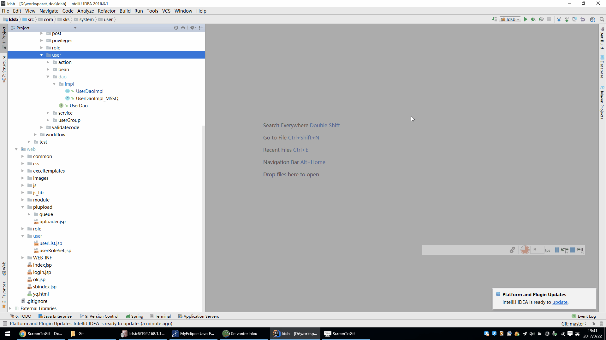

# patcher
idea导出增量补丁插件

# 说明
适用于`JavaWeb`项目，客户现场除了第一次为全量部署外，后面的升级都是增量补丁，本插件可选择导出要升级的文件。
把`patcher.jar`下载到`.IntelliJIDEAx0\config\plugins`目录，重启`Idea`，右击即可看到。
[原文](http://www.jetbrains.org/intellij/sdk/docs/basics/getting_started/deploying_plugin.html)

1、src的文件或文件夹导出时，直接导出对应的编译好的classes下的类
2、其他的文件或文件夹导出时与在项目中的目录一致
3、WEB-INFO/classes下的文件导出报错时，在moudle属性设置里把classes文件夹的Excluded属性去掉

操作如下：

